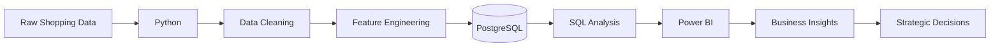

<div align="center">

# Customer Shopping Behavior Analysis

### Turning 3,900 customer transactions into actionable business insights


**Python • PostgreSQL • SQL • Power BI • Data Analytics**

</div>

---

## Project Overview

Customer behavior tells a story — **if you know how to read the data.**

This project analyzes **3,900 customer purchases** to uncover patterns in customer spending, product preferences, subscriptions, discounts, shipping choices and customer loyalty.

The project follows a complete end-to-end analytics workflow:

```text
Raw Data
   ↓
Python Data Cleaning
   ↓
Feature Engineering
   ↓
PostgreSQL Database
   ↓
SQL Business Analysis
   ↓
Power BI Dashboard
   ↓
Business Insights & Recommendations
```

The ultimate goal is to transform transactional data into **actionable business decisions**.

---

## Business Objectives

The analysis focuses on answering questions such as:

- Which customer groups generate the most revenue?
- Which products receive the highest ratings?
- Do subscribers spend more than non-subscribers?
- Which products depend most heavily on discounts?
- Does shipping preference relate to purchase value?
- Who are the most loyal customers?
- Which age groups contribute the most revenue?
- What products perform best within each category?

---

## Dataset Overview

| Metric | Value |
|---|---:|
| Total Transactions | **3,900** |
| Total Features | **18** |
| Missing Values | **37** |
| Product Categories | **4** |
| Customer Segments | **3** |

### Key Features

The dataset contains information across three major areas:

**Customer Demographics**

`Age` • `Gender` • `Location` • `Subscription Status`

**Purchase Information**

`Item Purchased` • `Category` • `Purchase Amount` • `Season` • `Size` • `Color`

**Shopping Behaviour**

`Discount Applied` • `Promo Code Used` • `Previous Purchases` • `Frequency of Purchases` • `Review Rating` • `Shipping Type`

---

# Data Preparation & Feature Engineering

Python was used to transform the raw dataset into an analysis-ready format.

### Data Loading

The dataset was imported and explored using **Pandas**.

```python
import pandas as pd

df = pd.read_csv("shopping_behavior.csv")

df.info()
df.describe()
```

### Missing Value Treatment

The dataset contained **37 missing values** in the `Review Rating` column.

Instead of removing these records, missing ratings were imputed using the **median rating of the corresponding product category**.

```python
df["review_rating"] = df.groupby("category")["review_rating"] \
    .transform(lambda x: x.fillna(x.median()))
```

### Column Standardization

Column names were converted into `snake_case` format to improve readability and make SQL integration easier.

```python
df.columns = (
    df.columns
      .str.lower()
      .str.replace(" ", "_")
)
```

### Feature Engineering

New analytical features were created, including:

```text
age_group
purchase_frequency_days
```

Customers were grouped into meaningful age segments for deeper revenue analysis.

### Redundant Feature Removal

`discount_applied` and `promo_code_used` were checked for redundancy.

After validation, `promo_code_used` was removed from the analysis.

### PostgreSQL Integration

After cleaning, the transformed DataFrame was loaded into **PostgreSQL**, where SQL was used to answer business-focused questions.

---

# SQL Business Analysis

The project uses PostgreSQL to investigate **10 key business questions**.

| # | Analysis |
|---|---|
| 01 | Revenue by Gender |
| 02 | High-Spending Discount Users |
| 03 | Top 5 Products by Rating |
| 04 | Shipping Type Comparison |
| 05 | Subscribers vs Non-Subscribers |
| 06 | Discount-Dependent Products |
| 07 | Customer Segmentation |
| 08 | Top 3 Products per Category |
| 09 | Repeat Buyers & Subscriptions |
| 10 | Revenue by Age Group |

---

# Key Insights

## Revenue by Gender

The analysis found:

| Gender | Revenue |
|---|---:|
| Male | **$157,890** |
| Female | **$75,191** |

Male customers generated the larger share of total revenue in the analyzed dataset.

---

## Highest-Rated Products

The products with the highest average customer ratings were:

| Rank | Product | Avg. Rating |
|---:|---|---:|
|  | Gloves | **3.86** |
|  | Sandals | **3.84** |
|  | Boots | **3.82** |
|  | Hat | **3.80** |
|  | Skirt | **3.78** |

These products represent strong candidates for promotional campaigns and product positioning.

---

## Shipping Behaviour

| Shipping Type | Avg. Purchase |
|---|---:|
| Standard | **$58.46** |
| Express | **$60.48** |

Customers choosing **Express Shipping spend slightly more per transaction**, making them an interesting segment for targeted campaigns.

---

## Subscription Analysis

| Status | Customers | Avg. Spend | Revenue |
|---|---:|---:|---:|
| Subscriber | 1,053 | $59.49 | $62,645 |
| Non-Subscriber | 2,847 | $59.87 | $170,436 |

### Insight

Average spending is remarkably similar between subscribers and non-subscribers.

This suggests that the major opportunity may not simply be increasing subscriber spending — but rather **converting more customers into subscribers and improving subscriber value propositions**.

---

## Most Discount-Dependent Products

| Product | Discount Rate |
|---|---:|
| Hat | **50.00%** |
| Sneakers | **49.66%** |
| Coat | **49.07%** |
| Sweater | **48.17%** |
| Pants | **47.37%** |

These products rely heavily on discounted purchases.

Businesses should evaluate whether discounts are generating incremental demand or unnecessarily reducing margins.

---

## Customer Segmentation

Customers were segmented according to purchase history.

| Segment | Customers |
|---|---:|
| Loyal | **3,116** |
| Returning | **701** |
| New | **83** |

### Key Takeaway

The customer base contains a strong **Loyal** segment.

This creates an opportunity to:

> reward existing loyalty while designing campaigns that move **New → Returning → Loyal**.

---

## Best-Selling Products by Category

### Accessories

```text
 Jewelry      → 171 orders
 Sunglasses   → 161 orders
 Belt         → 161 orders
```

### Clothing

```text
 Blouse       → 171 orders
 Pants        → 171 orders
 Shirt        → 169 orders
```

### Footwear

```text
 Sandals      → 160 orders
 Shoes        → 150 orders
 Sneakers     → 145 orders
```

### Outerwear

```text
 Jacket       → 163 orders
 Coat         → 161 orders
```

These products can be prioritized in merchandising and promotional strategies.

---

##  Repeat Buyers & Subscription Status

Among customers with more than five previous purchases:

```text
Non-Subscribers  █████████████████████████  2,518
Subscribers      ██████████                   958
```

A significant number of repeat buyers are still **not subscribed**.

###  Opportunity

These repeat customers represent a high-potential audience for subscription conversion campaigns.

---

##  Revenue by Age Group

| Age Group | Revenue |
|---|---:|
|  Young Adult | **$62,143** |
|  Middle-aged | **$59,197** |
|  Adult | **$55,978** |
|  Senior | **$55,763** |

**Young Adults** generate the highest revenue among the analyzed age groups.

---

#  Power BI Dashboard

The final stage of the project transforms the analysis into an **interactive Power BI dashboard**.

### Dashboard KPIs

```text
┌────────────────────┬────────────────────┬────────────────────┐
│       3.9K         │       $59.76       │        3.75        │
│     Customers      │ Avg Purchase Value │ Avg Review Rating  │
└────────────────────┴────────────────────┴────────────────────┘
```

### Dashboard Analysis

The dashboard provides interactive views for:

-  Revenue by Category
-  Sales by Category
-  Revenue by Age Group
-  Sales by Age Group
-  Subscription Status
-  Shipping Type
-  Gender
-  Product Category

>  **Power BI dashboard screenshot**

---

# Business Recommendations

Based on the analysis, the following strategies can help improve customer value and business performance:

### 1. Boost Subscription Conversion

A large portion of repeat customers remain non-subscribers.

Target them with:

- Exclusive subscriber discounts
- Early product access
- Free/discounted shipping
- Loyalty rewards

---

### 2. Strengthen Loyalty Programs

Reward frequent shoppers to increase retention and maintain the strong Loyal customer base.

Possible strategies include:

```text
Points → Rewards → Exclusive Benefits → Higher Retention
```

---

### 3. Optimize Discount Strategy

Products such as **Hats, Sneakers, Coats, Sweaters and Pants** show high discount dependency.

Discounts should therefore be evaluated against:

**Sales Lift ↔ Profit Margin**

---

### 4. Promote High-Performing Products

High-rated and best-selling products should receive stronger placement across:

- Homepage campaigns
- Email marketing
- Recommendation systems
- Seasonal promotions
- Cross-selling campaigns

---

### 5. Target High-Value Customer Segments

Marketing campaigns can prioritize:

**Young Adults + Loyal Customers + Express Shipping Users + Repeat Non-Subscribers**

These groups present opportunities for revenue growth, retention, and subscription conversion.

---

# Tech Stack

<div align="center">

| Technology | Purpose |
|---|---|
| **Python** | Data Cleaning & Feature Engineering |
| **Pandas** | Data Manipulation |
| **PostgreSQL** | Database Management |
| **SQL** | Business Analysis |
| **Power BI** | Interactive Dashboard |
| **Jupyter Notebook** | Exploratory Analysis |

</div>

---

# Project Structure

```text
Customer-Shopping-Behavior-Analysis/
│
├── data/
│   ├── shopping_behavior.csv
│   └── cleaned_shopping_behavior.csv
│
├── notebooks/
│   └── customer_behavior_analysis.ipynb
│
├── sql/
│   └── business_analysis.sql
│
├── dashboard/
│   └── customer_behavior_dashboard.pbix
│
├── images/
│   └── customer_behavior_dashboard.png
│
├── reports/
│   └── Customer_Shopping_Behavior_Analysis.pdf
│
└── README.md
```

---

# Project Workflow



---

#  Skills Demonstrated

This project demonstrates practical experience in:

`Data Cleaning`
`Exploratory Data Analysis`
`Feature Engineering`
`SQL`
`PostgreSQL`
`Customer Segmentation`
`Business Intelligence`
`Power BI`
`Data Visualization`
`Business Problem Solving`

---

#  Project Highlights

```text
✓ 3,900 transactions analyzed
✓ End-to-end Python → SQL → Power BI workflow
✓ Missing-value treatment & feature engineering
✓ 10 business questions answered using SQL
✓ Customer segmentation analysis
✓ Product & discount performance analysis
✓ Interactive Power BI dashboard
✓ Actionable business recommendations
```

---

##  Future Improvements

Future versions of this project could include:

- Customer Lifetime Value (CLV) analysis
- RFM customer segmentation
- Market basket analysis
- Customer churn prediction
- Product recommendation system
- Predictive purchase modeling
- Automated ETL pipeline

---

<div align="center">

##  About This Project

Built as an **end-to-end Data Analytics portfolio project** demonstrating how raw transactional data can be transformed into meaningful business insights using:

### Python → PostgreSQL → Power BI

**If you found this project useful, consider starring the repository!**

<br>

</div>

<div align="center">

# Aditya Sharma

### Aspiring Data Analyst • Business Analyst • BI Developer

**Python • SQL • Power BI • Streamlit • Pandas • Excel • SQLite**


</div>
